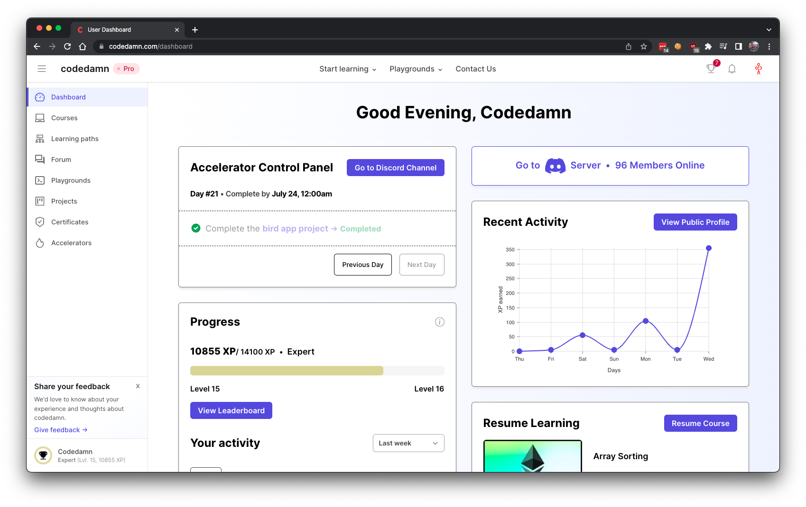
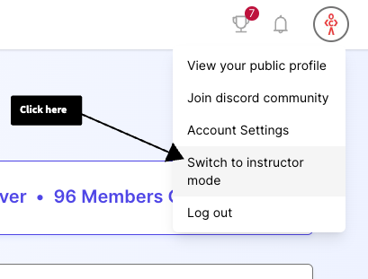
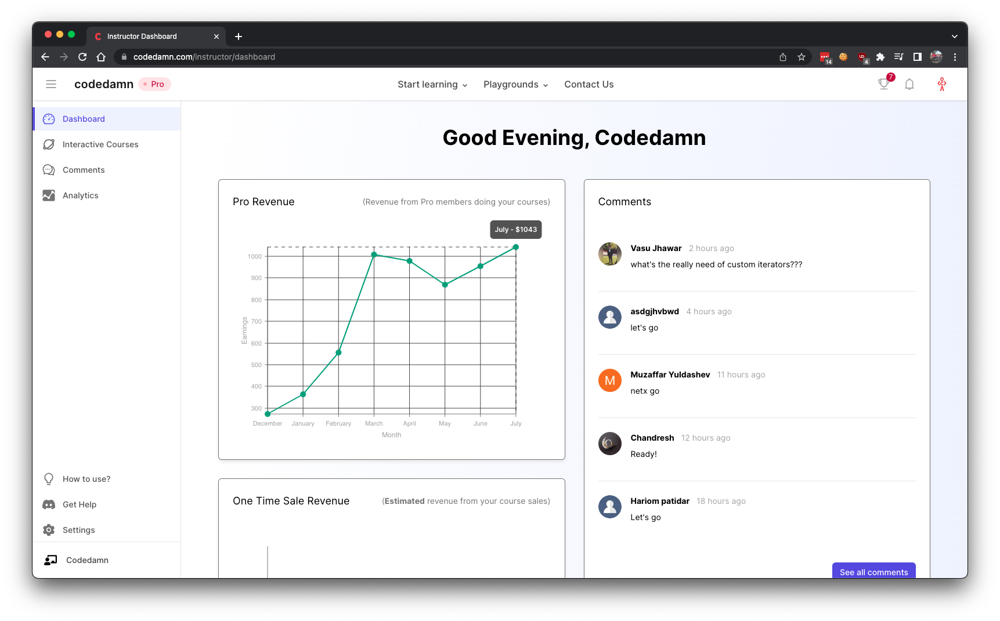

import Bleed from 'nextra-theme-docs/bleed'

# Instructor Account

The first step before creating an interactive course is to setup an instructor account on codedamn. Instructor account requires you to sign up for a free codedamn account in the first place.

## Creating Regular Account

If you don't have a free codedamn account, you can go to [the registration page](https://codedamn.com/register) and create an account for yourself.

Once the account is created, you'll see the following interface on the [user dashboard](https://codedamn.com/dashboard):

<Bleed></Bleed>

This is the user dashboard.

**To sign up for an instructor account now, go to the [instructor landing page](https://codedamn.com/instructor).**

## Switch to Instructor Dashboard

Once you have [signed up as an instructor](https://codedamn.com/instructor), for switching to instructor dashboard, click on the user profile icon on top right:

You should now be inside instructor dashboard:

<Bleed></Bleed>
