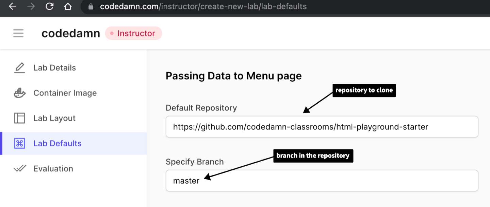
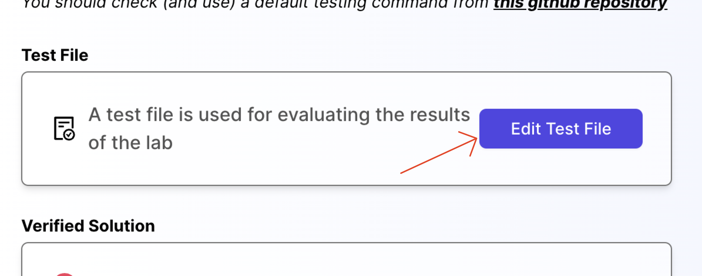
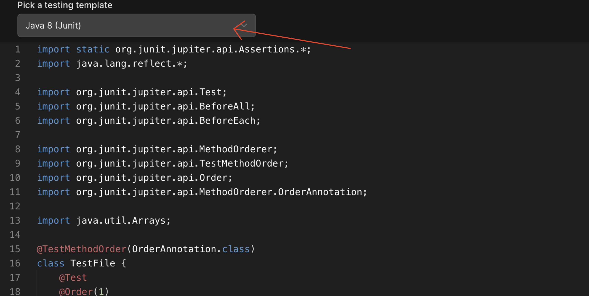
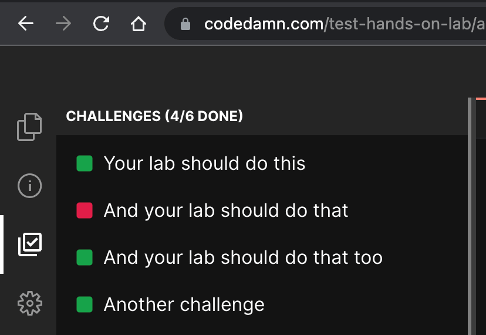

import Image from "next/image";

# How to create an interactive Java lab?

We'll divide this part into 4 sections:

1. [Creating lab metadata](#step-1---creating-lab-metadata)
2. [Setting up lab defaults](#step-2---lab-defaults)
3. [Setting up lab challenges](#step-3---lab-challenges)
4. [Setting up test file](#step-4---test-file)
5. [Providing custom input to stdin](#step-5---providing-custom-input-to-stdin)
6. [Reading the output from stdout](#step-6---reading-the-output-from-stdout)
7. [Setting up evaluation script](#step-7---evaluation-script)

## Introduction

This guide would assume that you already have created an interactive course from your instructor panel. If not, [go here and set it up first](https://codedamn.com/instructor/interactive-courses)

## Step 1 - Creating lab metadata

- Add a new item lab in your course curriculum page


- A new lab item gets added. Click on the edit pencil button on the right. This should open the lab library widget in your instructor panel.


- Initially, it will be blank for you. In order to create a new lab, you can click on "Create New Lab" button inside this modal. Once done, it should open the following view:


This is where you will add metadata to your labs and setup your labs for evaluation. Let's take a look at all the tabs here.

### Lab Details

Lab details is the tab where you add two important things:

- Lab title
- Lab description

Once both of them are filled, it would appear as following:


Let's move to the next tab now.

### Container Image

Container image should be set as "Java" for Java labs. The following software are available by default in this image:

- openjdk 11.0.16 2022-07-19
- OpenJDK Runtime Environment (build 11.0.16+8-post-Ubuntu-0ubuntu120.04)
- OpenJDK 64-Bit Server VM (build 11.0.16+8-post-Ubuntu-0ubuntu120.04, mixed mode, sharing)
- Java LSP to provide IntelliSense


### Lab Layout

Lab layout can be used to set a default layout in which the lab boots. We currently support the following layout types:

#### Terminal + IDE + Browser

This would include everything codedamn has to offer - a terminal at the bottom, an IDE in center (powered by Monaco on desktops, and CodeMirror on mobile phones), and a browser preview of (ideally) what user is working on. This is best for frontend/full-stack projects involving browser previews.

#### Terminal + Browser

This layout is for times when you don't need IDE in place, and only want something hosted inside a browser - like a XSS challenge.

#### Terminal + IDE

This layout is for backend programming without website UI. This would only include a terminal and an IDE - like VS Code. For example - headless E2E testing, writing Python scripts, Java scripts, discord bots, etc.

#### Terminal only

This would not include anything, except for a terminal. Best for Linux/bash labs where you want users to exclusively work with terminals only.

_Note: In future, students would be able to change the default layout once the lab as booted._

## Step 2 - Lab Defaults

Lab defaults section include how your lab environment boots. It is one of the most important parts because a wrong default environment might confuse your students. Therefore it is important to set it up properly.

When a codedamn playground boots, it can setup a filesystem for user by default. You can specify what the starting files could be, by specifying a git repository and a branch name:



**Important note:** For Java playground, we recommend you to fork the following repository and use it as a starter template: [Java playground starter - codedamn](https://github.com/codedamn-classrooms/java-starter-playground)

You will find a `.cdmrc` file in the repository given to you above. It is highly recommend, at this point, that you go through the [.cdmrc guide and how to use .cdmrc in playgrounds](/cdmrc) to understand what `.cdmrc` file exactly is. Once you understand how to work with `.cdmrc` come back to this area.

## Step 3 - Lab challenges

Next step is to setup challenges and evaluation for your lab. This is the part where your learners can learn the most because they will have to pass certain challenges.

This is the biggest advantage of using codedamn for hosting your course too - to make them truly interactive and hands-on for your users.

Let's start by setting up challenges.


The interface above can be used to add challenges to your lab. Once you add what you want the users to do in this interface, you can safely click on `Create Lab` button to create your lab.

**Note:** You **have** to create the lab before moving to next step. This is because you will only get the ability to create evaluation script if your lab is saved at least once.

## Step 4 - Test file

Once you save the lab, you will see a button named `Edit Test File` in the `Evaluation` tab. Click on it.



When you click on it, a new window will open. This is a test file area.

You can write anything here. Whatever script you write here, can be executed from the `Test command to run section` inside the evaluation tab we were in earlier.

The point of having a file like this to provide you with a place where you can write your evaluation script.

**For Java labs, you can use the default test file of Java (JUnit) evaluation:**



The moment you select the Java (JUint), the following code should appear in your editor:

```java
import static org.junit.jupiter.api.Assertions.*;

import java.io.ByteArrayInputStream;
import java.io.InputStream;
import java.io.PrintStream;

import org.junit.jupiter.api.*;
import org.junit.jupiter.api.MethodOrderer.OrderAnnotation;
import java.io.ByteArrayOutputStream;
import java.lang.reflect.Method;


@TestMethodOrder(MethodOrderer.OrderAnnotation.class)
class TestFile {

    @BeforeAll
    public static void setupStuff() { // Runs before each test

    }

    @AfterAll
    public static void doCleanup() { // Runs after each test case

    }

    @Test
    @Order(1)
    public void test1() {
        try {
            Class classNameToTest = Class.forName("<Class Name Here>");
            Method methodToTest = classNameToTest.getMethod("< Method Name Here >"); // Optional: Add parameter types as second argument here

            var returnedOutput = methodToTest.invoke(null, null); // Give arguments as an array in 2nd parameter

            assertTrue(true); // Check for the expected output

        } catch(Exception e) {
            fail();
        }
    }
}
```

Let us understand what is happening here exactly:

- Remember that we can code anything in this file and then execute it later. In this example, we're writing a JUnit test in Java.
- With Java testing, it is possible that the user doesn't create methods or classes that you need to test. This might result in your whole test file to crash **if** you try to import it globally at the top.
- Therefore, we **recommend** to use Reflection API in Java to test everything. This allows you to strictly pass/fail tests even if the methods/classes don't exist. Otherwise, your boilerplate code would always need to have empty definitions and all classes pre-made.
- Reflection API might look very verbose in syntax but is fairly straightforward to implement once you understand the basics. You should learn about how to work with Reflection API in Java here: [Reflection API docs](https://javapapers.com/core-java/java-reflection-cheat-sheet/)
- Also note that the tests here are run in order through `@TestMethodOrder(MethodOrderer.OrderAnnotation.class)` and `@Order(1)` decorators. This is important if you want to map the results of these tests (passed/failed) correctly with the tests you added in challenges tab earlier.


- Let's say your tests results from up is PASS, FAIL, PASS, PASS. Then, the following would be the output on playground:



- **Note:** If your test suite contain less tests than challenges added back in the UI, the "extra" UI challenges would automatically stay as "false". If you add more challenges in test file, the results would be ignored. Therefore, it is **important** that the number of tests you write in the testing class is same as the number of challenges you added in the challenges UI.

This completes your evaluation script for the lab. Your lab is now almost ready for users.

## Step 5 - Providing custom input to stdin

In order to provide custom inputs to the program, you can use the pre defined `provideInput()` method that accepts String data and provides input to the program when it requires.

Code Example:

```java
// Main.java (User's Code)

import java.util.Scanner;

public class Main {
    public static void main(String args[]) {
        Scanner scanner = new Scanner(System.in);

        int x = scanner.nextInt();
        int y = scanner.nextInt();

        System.out.println(x);
        System.out.println(y);
    }
}
```

```java

// Test File

public static void provideInput(String data) { // Used to give and test custom inputs (Use-full for Scanner class)
    inputStream = new ByteArrayInputStream(data.getBytes());
    System.setIn(inputStream);
}

@Test
@Order(1)
public void test1() {
    try {
        provideInput("3\n4\n"); // It would assign x = 3 and y = 4 in the above code

        Class classNameToTest = Class.forName("Main");
        Method methodToTest = classNameToTest.getMethod("main", String[].class); // Optional: Add parameter types as second argument here

        var returnedOutput = methodToTest.invoke(null, (Object) null); // Give arguments as an array in 2nd parameter

        assertEquals("3\n4\n", returnedOutput); // Check for the expected output

    } catch(Exception e) {
        fail();
    }
}

```

## Step 6 - Reading the output from stdout

There are situations when you want to validate the output that is being printed on the terminal. For example, If you ask the user to write a simple Java code that prints 'Hello World', and you want to test if the user was able to print it correct or not, in this case you can easily compare the terminals output by the expected output using the `ByteArrayOutputStream`.

In your test() method, you can use the `out.toString()` method from the `out` object declared at the class level to read the output from the terminal and finally do a `assertEquals()` to compare the output.

Sample Code to check `Hello World` program:

```java
import static org.junit.jupiter.api.Assertions.*;

import java.io.ByteArrayInputStream;
import java.io.InputStream;
import java.io.PrintStream;

import org.junit.jupiter.api.*;
import org.junit.jupiter.api.MethodOrderer.OrderAnnotation;
import java.io.ByteArrayOutputStream;
import java.lang.reflect.Method;


@TestMethodOrder(MethodOrderer.OrderAnnotation.class)
class TestFile {

    // IO Streams
    private static final  ByteArrayOutputStream out = new ByteArrayOutputStream();
    private static final ByteArrayOutputStream err = new ByteArrayOutputStream();
    private static ByteArrayInputStream inputStream;

    // Backup Streams
    private static final PrintStream originalOut = System.out;
    private static final PrintStream originalErr = System.err;
    private static final InputStream originalInput = System.in;


    @BeforeAll
    public static void setStreams() { // Override all the streams to our custom IO streams
        System.setOut(new PrintStream(out));
        System.setErr(new PrintStream(err));
    }

    @AfterAll
    public static void restoreInitialStreams() { // Restores all the streams to its original backups
        System.setOut(originalOut);
        System.setErr(originalErr);
        System.setIn(originalInput);
    }


    @Test
    @Order(1)
    public void test1() {
        try {
            Class classNameToTest = Class.forName("<Class Name Here>");
            Method methodToTest = classNameToTest.getMethod("< Method Name Here >"); // Optional: Add parameter types as second argument here

            var returnedOutput = methodToTest.invoke(null, null); // Give arguments as an array in 2nd parameter

            String outputFromConsole = out.toString(); // Reads the output from the terminal

            assertTrue(true); // Check for the expected output

        } catch(Exception e) {
            fail();
        }
    }
}
```

## Step 7 - Evaluation Script

Evaluation script is actually what runs when the user on the codedamn playground clicks on "Run Tests" button.


Since we have already written a pure evaluation script that runs as a JUint test utility, all we have to do is trigger that script via Java + JUnit and write it to proper file `$UNIT_TEST_OUTPUT_FILE` for the UI to show the results.

```bash
#!/bin/bash
set -e 1

# Compile user code
cd /home/damner/code
javac -cp . *.java

# setup test env
mkdir -p /home/damner/.javatest
mv $TEST_FILE_NAME /home/damner/.javatest/TestFile.java

# Download the junit5main.jar binary if not present
[ -e "/home/damner/.javatest/junit5main.jar" ] || curl https://raw.githubusercontent.com/codedamn-classrooms/java-junit-files/main/junit5main.jar -o /home/damner/.javatest/junit5main.jar

# Compile test file
cd /home/damner/.javatest
javac -cp .:junit5main.jar TestFile.java

# Run the test file
cd /home/damner/.javatest
java -jar junit5main.jar -cp .:/home/damner/code --select-class TestFile --reports-dir . || true

# Convert TEST-junit-jupiter.xml to JSON
cd /home/damner/.javatest
yarn add xml2js
cat > processJavaResults.js << EOF
const fs = require('fs')
const xmlFile = fs.readFileSync('./TEST-junit-jupiter.xml', 'utf8')
const { parseString } = require('xml2js')
parseString(xmlFile, (err, data) => {
    const results = []
    console.log(data.testsuite.testcase[0])
    for (let i = 0; i < data.testsuite.testcase.length; i++) {
        results.push(!data.testsuite.testcase[i].failure)
    }

    fs.writeFileSync(process.env.UNIT_TEST_OUTPUT_FILE, JSON.stringify(results))
})
EOF

# Run the node script to write results to playground UI
cd /home/damner/.javatest
node processJavaResults.js
```

This will make sure we run the full Java script and write the results properly for the playground IDE to read.

Let us understand what exactly is happening here:

- We first of all, compile all the user code by going to `/home/damner/code` directory and running `javac -cp . *.java`. This would compile all files. If you want to compile your user code in a different way, you can do it here.
- Next, we setup a temporary folder outside of user working space to download JUnit.
- JUnit jar binary would be downloaded only once. On subsequent runs, it would be reused.
- We then compile the `TestFile.java` (the JUnit code that we wrote in the full JUnit testing script above) with `junit5main.jar` being in the classpath.
- Finally, we run the `TestFile` class using `--select-class TestFile` (remember, this is the same class name of the JUnit test script as we wrote above in Test File section).
- We also add the user code in the classpath here itself so that we can import it directly in the test file (as we do).
- Finally, the `--reports-dir` flag outputs the result in the same directory which then we read with a simple Node.js script.
- JUnit outputs the results in XML. We use a simple `xml2js` parser to convert this into a JS object, and then convert the results into a boolean JSON array. We write this array inside `$UNIT_TEST_OUTPUT_FILE` which is then read by the playground and challenges are marked as passed or failed.

**Note:** You can setup a full testing environment in this block of evaluation script (installing more packages, etc. if you want). However, your test file will be timed out **after 30 seconds**. Therefore, make sure, all of your testing can happen within 30 seconds.

## Setup Verified Solution (Recommended)

Verified solution is highly recommended. To setup a verified solution for your lab, once your lab is ready, all you have to do is click on "Test lab", write code that passes your lab, and run that code once.


Once you do that, your lab would be marked a lab having verified solution. It also helps students as we can show them a Monaco diff editor showing the verified solution from the creator (you).


At this point, your lab is complete. You can now link this lab in your course, ready to be served to thousands of students :)
